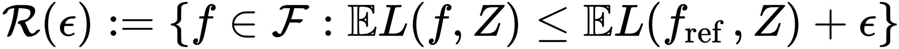
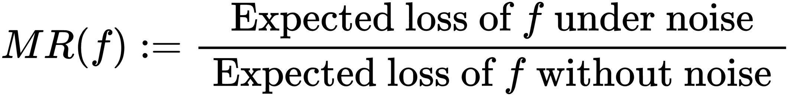

## Конспекты статей 

- **Accurate and Robust Feature Importance Estimation under Distribution Shifts, 2020**  [[paper]](https://arxiv.org/pdf/2009.14454.pdf)

  - описывается подход к оценке важности признаков для нейросетей: основная сеть обучается совместно с дополнительной (second net), у которой:
    - цель - научиться предсказывать loss основной сети
    - input - латентные представления после некоторых слоёв основной сети
    - loss
      - contrastive training - сохраняем правильное упорядочивание пар скоров
      - dropout calibration - hinge loss + доверительные интервалы
  - используется Granger определение причинности (связь между признаком и целевой переменной сущетсвует, если качество только ухудшится при отбрасывании данного признака)
  - важность признака - разница предсказаний вспомогательной сети с его маскированием и без  
    *Итог*:
    - на 15-30 % лучше качество, чем у Shap
    - при увеличении различия распределения x_test, по сравнению с x_train, loss second net монотонно растёт
    - подход устойчивей при сильных изменениях x_test Deep_Shap'а в 2 раза

- **Feature Importance Ranking for Deep Learning, 2020** [[paper]](https://arxiv.org/pdf/2010.08973.pdf)

  - рассматривается две сети operator net и selector net, маски для признаков - бинарные вектора (1 - берем признак, 0 - нет), оптимальное кол-во признаков - гиперпараметр
  - обучение происходит поочередно
  - operator net:
    - цель - обучение с учителем конкретной задачи
    - input - x и маска признаков
    - loss - соответствующий задаче
  - selector net:
    - цель - предсказать loss operator net
    - input - маска признаков
    - loss - l2 с loss'ом, переданным от operator net
  - важность признака - соответствующая компонента градиента loss'а selector net'а в точке оптимального набора признаков
  - процесс построения оптимального набора очень долгий  
    *Итог*:
    - в среднем лучше качество на синтетических данных
    - лучшее RFE, BAHSIC, mRMR, CCM на 4-ёх benchmark датасетах

- **Knockoffs for the mass: new feature importance statistics with false discovery guarantees, 2019** [[paper]](https://arxiv.org/pdf/1807.06214.pdf)

  - аппроксимируется распределение данных (только признаки) байесовскими сетями
  - используется аугментация выборки определённым образом (чтобы не выходить за исходное распределение)
  - вместо того, чтобы перемешивать значения признака (в permutation importance), берется взвешенная сумма исходного признака и соответствующего признака из аугментированной выборки
  - важность признака - площадь под кривой (y - доля правильно отобранных признаков, x - параметр взвешенной суммы) для некоторого диапазона (например, [0, 10])
  - FDR в реальности нельзя оценить, предполагается, что мы хорошо моделируем распределение выборки

- **A Unified Approach to Interpreting Model Predictions, 2017** [[paper]](https://proceedings.neurips.cc/paper/2017/file/8a20a8621978632d76c43dfd28b67767-Paper.pdf)

  - рассматривается семейство аддитивных explanation models
  - в данном классе существует единственная explanation model, удовлетворяющая свойствам:
    - local accuracy - совпадение значений f(x) и exp_model(x')
    - missingness - признак, не присутствующий в x, будет иметь нулевую важность
    - consistency - признак во всевозможных комбинациях остальных имеет не меньшее значение на изменение выхода f, чем на f' -> его важность для f >= важность для f'
  - считать такую explanation model дорого
  - Linear LIME + Kernel SHAP дают истинные значения SHAP values
  - в случае f = max, можно за квадрат размерности признаков SHAP посчитать (пользуемся свойствами max)
  - Deep SHAP - вместо важности в DeepLIFT подставляем SHAP важность для промежуточных расчётах  
    *Итог*:
    - обобщили предыдущие методы
    - на реальной задаче SHAP важность совпала с человеческой
    - для конкретных моделей улучшили время расчёта

- **Learning Important Features Through Propagating Activation Differences, 2017** [[paper]](https://arxiv.org/pdf/1704.02685.pdf)

  - метод основан на разнице значений нейронов между начальным значением (reference) и конечным
  - разделяются положительный и отрицательный вклады в целевую переменную
  - важность признака линейно зависит от разницы x - x_reference
  - важность - shapley value с количеством разбиений 2
  - x_reference выбирается в зависимости от задачи  
    *Итог*:
    - использование разности x - x_reference позволяет информации распространяться когда градиент равен нулю
    - gradients, gradients*input, guided backprop, rescale rule теряют зависимости в ходе вычисления важности в некоторых случаях в отличии от предложенного reveal_cancel rule

- **CXPlain: Causal Explanations for Model Interpretation under Uncertainty, 2019** [[paper]](https://arxiv.org/pdf/1910.12336.pdf)

  - используется Granger's definition of causality (в реальности, исходя только из данных, нельзя проверить)
    - все признаки релевантные
    - признак временно предшествует метке (для того, чтобы получить метку, нужна информация о признаке)
  - истинная важность признака - нормированная разница ошибок объясняемой модели на x_mask и x_reference
  - обучается explanation model (подходящая решаемой задаче)
    - цель - предсказать важность признаков
    - input - маскированный элемент x_train
    - loss - расстояние Кульбака — Лейблера между истинным и предсказанным распределениями важностей признаков
  - для устойчивости обучаем ансамбль explanation_models (на сэмплированных выборках), предсказанная важность - медиана предсказаний ансамбля, а точность - интерквантильный размах  
    *Итог*:
    - точность оценки важности коррелирует с ошибкой ранжирования важности признаков
    - при небольшой мощности ансамбля (5) хорошо оценивается точность explanation_model
    - качество лучше на 20%, быстрее x100, чем Shap, Lime на Mnist и ImageNet
    - качество сильно зависит от устройства explanation_model

- **Bias in random forest variable importance measures, 2017** [[paper]](https://link.springer.com/content/pdf/10.1186/1471-2105-8-25.pdf)

  - имплементирован метод построения дерева (ctree), где выбор переменной осуществляется путем минимизации значения p критерия независимости условного вывода, сравнимого, например, с тестом χ2 со степенью свободы, равной числу категорий признака
  - лучше себя показывает, чем rf в синтетических экспериментах (с/без бутстрэпом, способ сэмплинга)
  - bias в важности признаков в rf возникает из-за того, что признаки с большим количество уникальных значений располагаются ближе к корню дерева
  - рассматривается две оценки важности признака
    - количество узлов, в которых используется признак для разделения выборки (selection frequency)
    - permutation importance
    - Gini importance (большой bias)  
      *Итоги экспериментов*:
    - сэмплинг с возвратом сильно смещает selection frequency в сторону признаков с большим числом уникальных значений
    - permutation importance более устойчив

- **Grouped variable importance with random forests and application to multiple functional data analysis, 2015** [[paper]](https://arxiv.org/pdf/1411.4170.pdf)

  - рассматривается оценка важности группы признаков с теоретической и практической стороны
  - теоретическая сторона
    - (признаки, целевая переменная) - случайный вектор
    - важность признака - разница квадратичного риска с заменой/без замены признака на одинакового распределенный признак, но не зависящий от остальных и целевой переменной
    - в определённых условиях важность группы признаков пропорциональна дисперсии функции (=модель) от этой группы
  - практическая сторона
    - важность группы признаков - oob + случайная перестановка строк для столбцов из группы
    - используется RFE
  - с помощью вейвлет декомпозиции можно получить различные разбиения коэффициентов на группы
  - для отбора некоторых групп не применим алгоритм RFE, т.к. существует общая составляющая, вносящая большой вклад -> делим интересующий параметр на сетку и вычисляем важность в конкретных точках  
    *Итоги экспериментов*:  
    - оценка важности согласовывается как с синтетическими экспериментами, так и с реальными

- **Correlation and variable importance in random forests, 2017** [[paper]](https://arxiv.org/pdf/1310.5726.pdf)

  - продолжение вышеописанной работы 
  - эмпирическая важность признака при использовании purely rf для независимых признаков сходится экспоненциально к теоретической при стремлении количества итераций разбиения узла дерева и мощности тренировочной выборки так, чтобы отношение первого ко второму стремилось к 0 
  - даже сильно коррелирующие признаки с целевой переменной могут получить малую важность из-за корреляции между собой  
    *Итоги экспериментов*:  
    - NRFE и RFE в целом имеют одинаковое качество

- **All Models are Wrong, but Many are Useful, 2018** [[paper]](https://arxiv.org/pdf/1801.01489.pdf)
  Идея - будем искать важность группы признаков X_1 не для одной хорошей модели (reference model), а для класса моделей
  Датасет - iid
  Введём несколько определений:
  a population ε-Rashomon  set:  

  model relience: 

  a population-level model class reliance (MCR) range: 
  the set of functionsGras anr-margin-expectation-coverif for anyf∈ Fand anydistributionD, there existsg∈Grsuch that
  *the covering number N(F,r)* to be the size of the smallest-margin-expectation-cover for F

  - If MCR+() is low, then no well-performing model in F places high importance on feature

  Возможны следующие вариации empirical MR:  /divide 
    

  - The estimators  ˆeorig(f),  ˆeswitch(f) and  ˆedivide(f) all belong to the well-studied class ofU-statistics.  Thus, under fairly minor conditions, these estimators are *unbiased, asymptot-ically normal, and have finite-sample probabilistic bounds*
  - Errors are calculated on the train dataset

  We introduce three bounded loss assumptions: 

  - some constants can be derived from others

  

  - As n increases, out approachesandQoutapproaches zero
    
  - the largest possible estimation error forMR(f) across all models inFis bounded byq(δ,r,n), which can be made arbitrarily smallby increasingnand decreasingr. 
  - The  existence  of  this  uniform  bound  implies  that  it  is  feasible  to  train  a  model  and  to evaluate its importance using the *same data*
    
    -

  Calculating Empirical Estimates of Model Class Reliance (MCR_-)

  - ComputinĝMCR+() however will require that we are able to minimize arbitrary linearcombinations of ˆeorig(f) and ˆeswitch(f). 
  - we present bound functionsb−andb+satisfyingb−(abs)≤̂MR(f)≤b+(abs) simultaneously for all{f,abs:  ˆeorig(f)≤abs,f∈F,abs>0}(Figures2 & 8 show examples of these bounds).  The binary search procedures we propose can beused to tighten these boundaries at a particular valueabsof interest.
  - Almost all of the results shown in this section, and those in Section 6.2, also hold if wereplace ˆeswitchwith ˆedividethroughout (see Eq 3.5), including in the definition of̂MRandˆh−,γ(f). 
  - 
  - 
  - It remains to determine which value ofγshould be used in Eq 6.1.  The following lemmaimplies that this value can be determined by a binary search, given a particular value ofinterest forabs.
  - 
    - he tightest lower bound from Eq 6.1 occurs whenγis as low aspossible while still satisfying Condition 8.
  -  
    - Если выполняются, то minimizingˆh−,γforγ≥0 is equivalent to minimizing areweighted empirical loss over an expanded sample of sizen2
      
    - с rf условия не выполняются 

  Calculating Empirical Estimates of Model Class Reliance (MCR_+)

  - 

  -  
    Convex Models

  - идея: пусть функции параметризуются некоторым вектором переменных, разобьём это пространство на симплексы, на них h совпадает в вершинах с некоторой гиперплоскостью, заменяем h её, получаем нижнию оценку, так для всех подвыборок из пространства и индуктивно повторяем процедуру
    MR & MCR for Linear Models, Additive Models

  - 

  - 

    - сложность вычисления растёт линейно

  - 

  - 

  - The resulting optimization problem is a (possibly non-convex) quadratic program withone  quadratic  constraint 

  - 
    Regression Models in a Reproducing Kernel Hilbert Space

  - 
    Calculating MCR

  - 
    Upper Bounding the Loss
    
    Model Reliance and Causal Effects

  -   
    Conditional Importance:  Adjusting for Dependence BetweenX1andX2

  -  

  - This means thatCMR will not be influenced by impossible combinations ofx1andx2, while MR may beinfluenced by them
    Estimation of CMR by Weighting, Matching, or Imputation

  -  

  -  
    However, when the covariate space is continuous or high dimensional, we typically cannotestimate  CMR  nonparametrically.
    when the covariate space is continuous or high dimensional
    
    Simulations of Bootstrap Confidence Intervals  

  - идея: 
    1 подход
    возьмём ориг. датасет (20k записей), посчитаем на нем MCR, разделим весь датасет на 2 части
    training subset and analysis subset

    - на training subset: обучаем reference model
    - на analysis subset: сэмплируем выборку (500 times) и считаем emp_MCR_- и emp_MCR_+, а после CI

    2 подход (проще)
    cэмплируем выборку с ориг. датасета (500 times), делим его на 2 части

    - на 1ой части обучаем модель
    - на 2ой оцениваем её emp_MR
      получаем CI
      Итог: 1 подход more robust to the misspecification of the models used to approximate Y and the model of Y itself

  COMPAS score
  The bootstrap 95% CI for MCR on “inadmissiblevariables” is [1.00, 1.73]
  For “admissible variables” the MCR range with a 95% bootstrapCI is equal to [1.62, 3.96]

  *Итоги экспериментов*:  
Assumption\ 1\ (Bounded\ individual\ loss)\ For\ a\ given\ model\ f\ \in\ \mathcal{F},\ assume\ that\ 0 \leq L\left(f,\left(y, x_{1}, x_{2}\right)\right) \leq B_{\text {ind }} for any \left(y, x_{1}, x_{2}\right) \in\left(\mathcal{Y} \times \mathcal{X}_{1} \times \mathcal{X}_{2}\right)
    -

