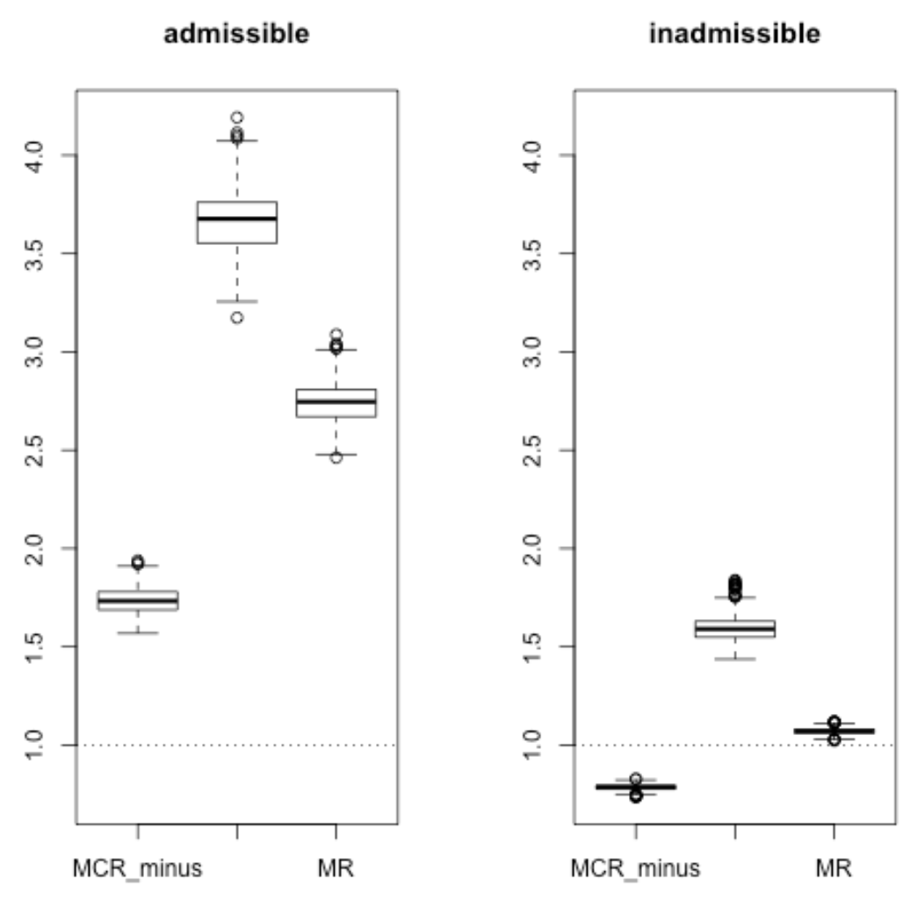

<!--- 
activate p2
python -m readme2tex --nocdn --output papers.md --rerender papers_raw.md 
-->
# Конспекты статей
1. [Thiagarajan JJ at el (2020) Accurate and Robust Feature Importance Estimation under Distribution Shifts](#6)

## <a name="1" /> Thiagarajan JJ at el (2020) [Accurate and Robust Feature Importance Estimation under Distribution Shifts](https://arxiv.org/pdf/2009.14454.pdf)
- описывается подход к оценке важности признаков для нейросетей: основная сеть обучается совместно с дополнительной (second net), у которой:
  - цель - научиться предсказывать loss основной сети
  - input - латентные представления после некоторых слоёв основной сети
  - loss
    - contrastive training - сохраняем правильное упорядочивание пар скоров
    - dropout calibration - hinge loss + доверительные интервалы
- используется Granger определение причинности (связь между признаком и целевой переменной сущетсвует, если качество только ухудшится при отбрасывании данного признака)
- важность признака - разница предсказаний вспомогательной сети с его маскированием и без  
*Итог*:
- на 15-30 % лучше качество, чем у Shap
- при увеличении различия распределения x_test, по сравнению с x_train, loss second net монотонно растёт
- подход устойчивей при сильных изменениях x_test Deep_Shap'а в 2 раза

## <a name="2" /> Wojtas M, Chen K (2020) [Feature Importance Ranking for Deep Learning](https://arxiv.org/pdf/2010.08973.pdf)
- рассматривается две сети operator net и selector net, маски для признаков - бинарные вектора (1 - берем признак, 0 - нет), оптимальное кол-во признаков - гиперпараметр
- обучение происходит поочередно
- operator net:
  - цель - обучение с учителем конкретной задачи
  - input - x и маска признаков
  - loss - соответствующий задаче
- selector net:
  - цель - предсказать loss operator net
  - input - маска признаков
  - loss - l2 с loss'ом, переданным от operator net
- важность признака - соответствующая компонента градиента loss'а selector net'а в точке оптимального набора признаков
- процесс построения оптимального набора очень долгий  
*Итог*:
- в среднем лучше качество на синтетических данных
- лучшее RFE, BAHSIC, mRMR, CCM на 4-ёх benchmark датасетах

## <a name="3" /> Gimenez JR, Ghorbani A, Zou J (2019) [Knockoffs for the mass: new feature importance statistics with false discovery guarantees](https://arxiv.org/pdf/1807.06214.pdf)
- аппроксимируется распределение данных (только признаки) байесовскими сетями
- используется аугментация выборки определённым образом (чтобы не выходить за исходное распределение)
- вместо того, чтобы перемешивать значения признака (в permutation importance), берется взвешенная сумма исходного признака и соответствующего признака из аугментированной выборки
- важность признака - площадь под кривой (y - доля правильно отобранных признаков, x - параметр взвешенной суммы) для некоторого диапазона (например, [0, 10])
- FDR в реальности нельзя оценить, предполагается, что мы хорошо моделируем распределение выборки

## <a name="4" /> Lundberg S, Lee S (2017) [A Unified Approach to Interpreting Model Predictions](https://proceedings.neurips.cc/paper/2017/file/8a20a8621978632d76c43dfd28b67767-Paper.pdf)
- рассматривается семейство аддитивных explanation models
- в данном классе существует единственная explanation model, удовлетворяющая свойствам:
  - local accuracy - совпадение значений f(x) и exp_model(x')
  - missingness - признак, не присутствующий в x, будет иметь нулевую важность
  - consistency - признак во всевозможных комбинациях остальных имеет не меньшее значение на изменение выхода f, чем на f' -> его важность для f >= важность для f'
- считать такую explanation model дорого
- Linear LIME + Kernel SHAP дают истинные значения SHAP values
- в случае f = max, можно за квадрат размерности признаков SHAP посчитать (пользуемся свойствами max)
- Deep SHAP - вместо важности в DeepLIFT подставляем SHAP важность для промежуточных расчётах  
*Итог*:
- обобщили предыдущие методы
- на реальной задаче SHAP важность совпала с человеческой
- для конкретных моделей улучшили время расчёта

## <a name="w" /> Shrikumar A, Greenside P, Kundaje A (2017) [Learning Important Features Through Propagating Activation Differences](https://arxiv.org/pdf/1704.02685.pdf)
- метод основан на разнице значений нейронов между начальным значением (reference) и конечным
- разделяются положительный и отрицательный вклады в целевую переменную
- важность признака линейно зависит от разницы x - x_reference
- важность - shapley value с количеством разбиений 2
- x_reference выбирается в зависимости от задачи  
*Итог*:
- использование разности x - x_reference позволяет информации распространяться когда градиент равен нулю
- gradients, gradients*input, guided backprop, rescale rule теряют зависимости в ходе вычисления важности в некоторых случаях в отличии от предложенного reveal_cancel rule

## <a name="1" /> Schwab P, Karlen W (2019) [CXPlain: Causal Explanations for Model Interpretation under Uncertainty](https://arxiv.org/pdf/1910.12336.pdf)
- используется Granger's definition of causality (в реальности, исходя только из данных, нельзя проверить)
  - все признаки релевантные
  - признак временно предшествует метке (для того, чтобы получить метку, нужна информация о признаке)
- истинная важность признака - нормированная разница ошибок объясняемой модели на x_mask и x_reference
- обучается explanation model (подходящая решаемой задаче)
  - цель - предсказать важность признаков
  - input - маскированный элемент x_train
  - loss - расстояние Кульбака — Лейблера между истинным и предсказанным распределениями важностей признаков
- для устойчивости обучаем ансамбль explanation_models (на сэмплированных выборках), предсказанная важность - медиана предсказаний ансамбля, а точность - интерквантильный размах  
*Итог*:
- точность оценки важности коррелирует с ошибкой ранжирования важности признаков
- при небольшой мощности ансамбля (5) хорошо оценивается точность explanation_model
- качество лучше на 20%, быстрее x100, чем Shap, Lime на Mnist и ImageNet
- качество сильно зависит от устройства explanation_model

## <a name="1" /> Strobl C, Boulesteix A, Zeileis A & Hothorn T (2017) [Bias in random forest variable importance measures](https://link.springer.com/content/pdf/10.1186/1471-2105-8-25.pdf)
- имплементирован метод построения дерева (ctree), где выбор переменной осуществляется путем минимизации значения p критерия независимости условного вывода, сравнимого, например, с тестом χ2 со степенью свободы, равной числу категорий признака
- лучше себя показывает, чем rf в синтетических экспериментах (с/без бутстрэпом, способ сэмплинга)
- bias в важности признаков в rf возникает из-за того, что признаки с большим количество уникальных значений располагаются ближе к корню дерева
- рассматривается две оценки важности признака
  - количество узлов, в которых используется признак для разделения выборки (selection frequency)
  - permutation importance
  - Gini importance (большой bias)  
*Итоги экспериментов*:
- сэмплинг с возвратом сильно смещает selection frequency в сторону признаков с большим числом уникальных значений
- permutation importance более устойчив

## <a name="6"/> Gregorutti B, Michel B, Saint-Pierre P (2015) [Grouped variable importance with random forests and application to multiple functional data analysis](https://arxiv.org/pdf/1411.4170.pdf)
- рассматривается оценка важности группы признаков с теоретической и практической стороны
- теоретическая сторона
  - (признаки, целевая переменная) - случайный вектор
  - важность признака - разница квадратичного риска с заменой/без замены признака на одинакового распределенный признак, но не зависящий от остальных и целевой переменной
  - в определённых условиях важность группы признаков пропорциональна дисперсии функции (=модель) от этой группы
- практическая сторона
  - важность группы признаков - oob + случайная перестановка строк для столбцов из группы
  - используется RFE
- с помощью вейвлет декомпозиции можно получить различные разбиения коэффициентов на группы
- для отбора некоторых групп не применим алгоритм RFE, т.к. существует общая составляющая, вносящая большой вклад -> делим интересующий параметр на сетку и вычисляем важность в конкретных точках  
*Итоги экспериментов*:  
- оценка важности согласовывается как с синтетическими экспериментами, так и с реальными

## <a name="1" /> Gregorutti B, Michel B, Saint-Pierre P (2017) [Correlation and variable importance in random forests](https://arxiv.org/pdf/1310.5726.pdf)**
- продолжение вышеописанной работы 
- эмпирическая важность признака при использовании purely rf для независимых признаков сходится экспоненциально к теоретической при стремлении количества итераций разбиения узла дерева и мощности тренировочной выборки так, чтобы отношение первого ко второму стремилось к 0 
- даже сильно коррелирующие признаки с целевой переменной могут получить малую важность из-за корреляции между собой  

*Итоги экспериментов*:
- NRFE и RFE в целом имеют одинаковое качество
  

## <a name="1" /> Kononenko I et al (2010) [An efficient explanation of individual classifications using game theory](https://www.jmlr.org/papers/volume11/strumbelj10a/strumbelj10a.pdf)
We present *a general method* for explaining *individual predictions* of *classification models*.  
**Example of the disadvantage of methods related to masking only 1 feature** Let model is 1 or 1, then importance of left and right 1s will be 0  
**Theorem** Let:  

  

  

  

  

Then:  is a coalitional form game and  corresponds to the game's Shapley value .  
**Main idea of the paper**  To use bootstrap sampling (with replacement) + the folowing definition:

  

The key to minimizing the number of samples is *to estimate the sample variance* and draw the appropriate number of samples.  
The optimal (*minimal*) number of samples we need for the entire explanation is    

### Experiments
The greater the variance in the model responses, the more samples will be required. For example, MLP have higher error/samples rate then logreg, dt, nb.

  
## <a name="1" /> Datta A, Sen S, Zick Y (2016) [Algorithmic transparency via quantitative input influence: theory and experiments with learning systems](http://www.andrew.cmu.edu/user/danupam/datta-sen-zick-oakland16.pdf) [[code]](https://github.com/hovinh/QII)
**Важность** - влияние input на интересующую функцию от   

Consider **expanded  probability  space** on , with distribution . Вариацию элемента из датасета будет делать с помощью 2-го вероятностного пространства.  
For a quantity  of interes , and an input , **the Quantitative Input Influence** of  on  is defined to be  

  

*QII for Individual Outcomes*  

  

*QII for Group Outcomes*  

  

  

*QII for Group Disparity*  

  

  

  

*Set  QII*  

  

*Marginal QII*  

  

:small_orange_diamond: для QII выполняются аксиомы, как для Shapley value  

### Transparency Schemas
It consists of the following elements:
- *A quantity of interest*, which captures the aspect of the system we wish to gain transparency into
- *An intervention distribution*, which defines how a counterfactual distribution is constructed from the true distribution
- *A difference measure*, which quantifies the difference between two quantities of interest
- *An aggregation technique*, which combines marginal QII measures across different subsets of inputs (features)
  
### Experiments  
В реальности сложность полного алгоритма большая -> сэмплируем выборку и на ней применяем алгоритм + добавляем шум  для приватности. Доказано, что при достаточном n можно приблизить оценки истинных параметров сколь угодно близко (по вероятности).  
Для определения влияния признака не достаточно его одного изменить. Нужно другие тоже изменить. Это обусловлено наличием скоррелированных признаков.  
Features correlated with the sensitive attribute are the most influential for group disparity according to the sensitive attribute instead of the sensitive attribute itself. It is in this sense that **QII measures can identify proxy variables** that cause associations between outcomes and sensitive attributes.  

Filter methods for computing the importance of a feature:
- Mutual Information
- Jaccard Index
- Pearson Correlation
- Disparate Impact Ratio  

Embedded importance:
- Bayesian Rule Lists
- Supersparse Linear IntegerModels
- Probabilistic  Scaling  
  
### Appendix
**Shapley value** - , where   
**The Banzhaf Index** defines as 
- index  is  not  guaranteed  to  be  *efficient*, i.e.  is not necessarily equal to . But satisfies *2-efficiency* property  
- the only function to satisfy (*sym*), (*d*), (*mono*) and (*2-eff*)
- tend to select sets with the cardinality equals to   

**The Deegan-Packel index** - 
- work with binary "outcome" () of subsets in 
  
  
## <a name="1" /> Fisher A, Rudin C, Dominici F (2018) [All models are wrong but many are useful: Variable importance for black-box, proprietary, or misspecified prediction models, using model class reliance](https://arxiv.org/pdf/1801.01489.pdf) [[code]](https://github.com/aaronjfisher/mcr-supplement)
**Идея** - будем искать важность группы признаков  не для одной хорошей модели (reference model), а для класса моделей  
**Датасет** - iid  

### Введём несколько определений:  
*a population ε-Rashomon set*:    
*model relience*:   
*a population-level model class reliance (MCR) range*:   
*the set of functions  as an  -margin-expectation-cover*: if for any  and any distribution  there exists  such that   
*the covering number *: to be the size of the smallest  -margin-expectationcover for   
> **_NOTE:_** If  is low, then no well-performing model in  places high importance on  and  can be discarded at low cost regardless of future modeling decisions. Similarly for .  

### Возможны следующие вариации empirical MR:
  
  
  
  

> **_NOTE:_** The estimators  and  all belong to the well-studied class of U-statistics. Thus, under fairly minor conditions, *these estimators are unbiased, asymptotically normal, and have finite-sample probabilistic bounds*  
> Можно заменить сочетание всех пар объектов на группы и внутри них делать такое сочетание  

  

 ### Illustrative Toy Example with Simulated Data    
**Building an empirical :**  
Обучаются reference model/models.  получается нормальным зашумлением координат одной выбранной reference model с дисперсиями:
- если дисперсия хотя бы одной координаты из соотвествующей колонки матрицы весов reference model/models == 0: все 1
- если дисперсия хотя бы одной координаты из соотвествующей колонки матрицы весов reference model/models != 0: соотвествующей дисперсией столбца  

Причём, если нам необходимо  (p-доля хороших моделей, n-количество всего моделей) в , то процедура поправки "плохой" модели осуществляется линейным приближением к reference model.  

### Simulations of Bootstrap Confidence Intervals  
**идея**:  
* 1 подход: возьмём ориг. датасет (20k записей), посчитаем на нем MCR, разделим весь датасет на 2 части training subset and analysis subset
  - на training subset: обучаем reference model
  - на analysis subset: сэмплируем выборку (500 times) и считаем , а после CI
- 2 подход (проще): cэмплируем выборку с ориг. датасета (500 times), делим его на 2 части:
  - на 1ой части обучаем модель
  - на 2ой оцениваем её , получаем CI  

**Итог**: 1 подход more robust to the misspecification of the models used to approximate Y and the model of Y itself  
    
### COMPAS score  
**Эксперимент**:  
Как влияют половые и подобные необъективные признаки на скор того, что подсудимый вновь разбоем.  

**Используемая модель:** регрессия + RBF ядро   
**Используемый датасет:** 500 train, 2873 test  
**Используемые признаки:**  

  
  

Итог:  
- 1000 бустреэп сэмплирований -> 12 часов  

The bootstrap 95% CI for  on “inadmissible variables” is **[1.00, 1.73]**  
For “admissible variables” the  range with a 95% bootstrap CI is equal to **[1.62, 3.96]**  

  

Идея работы алгоритма:  
- Считаем необходимые матрицы и значения (расстояния, коэффициент регуляризации и т.д.)  
- Считам MRC

### We introduce three bounded loss assumptions:  
**Assumption 1** (*Bounded individual loss*) For a given model  assume that   for any   
**Assumption 2** (*Bounded relative loss*) For a given model  assume that   for any   
**Assumption 3** (*Bounded aggregate loss*) For a given model  assume that  
> **_NOTE:_** some constants can be derived from others  

**Theorem 4** (*"Outer" MCR Bounds*) Given a constant , let  and  be prediction models that attain the highest and lowest model reliance among models in . If  and  satisfy Assumptions 1, 2, 3 , then

  

> **_NOTE:_**    
> - As  increases,  approaches  and  approaches zero
> - with high probability, the largest possible estimation error for  across all models in  is bounded by , which can be made arbitrarily small by increasing  and decreasing 
> - The  existence  of  this  uniform  bound  implies  that  it  is  feasible  to  train  a  model  and  to evaluate its importance using the *same data*  

**Theorem 6** (*"Inner" MCR Bounds*) Given constants  and  if Assumptions 1 , 2 and 3 hold for all  and then

  

### Calculating Empirical Estimates of MCR  
- computing  however will require that we are able to minimize arbitrary linear combinations of  and 
- we present bound functions  and  satisfying   simultaneously for all 
- almost all of the results shown in this section, and those in Section 6.2 . also hold if we replace  with  throughout (see Eq 3.5), including in the definition of  and   

### Binary Search for Empirical MR Lower Bound  
**Condition 8** (*Criteria to continue search for  lower bound*)  and   
**Lemma 9** (*Lower bound*) If  satisfies  then  satisfying 

  

for all  satisfying  It also follows that  

  

> **_NOTE:_**
> - Additionally, if  and at least one of the inequalities in Condition 8 holds with equality, then top Eq holds with equality.
> - It remains to determine which value of  should be used in top Eq. The following lemma implies that this value can be determined by a binary search, given a particular value of interest for   

**Lemma 10** (*Monotonicity for  lower bound binary search*) The following monotonicity results hold:  
1. .  
2.  is monotonically decreasing in .  
3. Given  the lower bound from  is monotonically decreasing in  in the range where  and increasing otherwise.  
> **_NOTE:_** the value of  resulting in the tightest lower bound from Eq 6.1 occurs when  is as low as possible while still satisfying Condition 8  

**Proposition 11** (*Nonnegative weights for  lower bound binary search*) Assume that  and  satisfy the following conditions.
1. (Predictions are sufficient for computing the loss) The loss  depends on the covariates  only via the prediction function  that is,   

  

2. (Irrelevant information does not improve predictions) For any distribution  satisfying , there exists a function  satisfying  

  

Let . Under the above assumptions, it follows that either (i) there exists a function  minimizing  that does not satisfy Condition  or   and  1 for any function  minimizing .  

> **_NOTE:_** tractability of our approach, as minimizing  for  is equivalent to minimizing reweighted empirical loss over an expanded sample of size :  
> 
> 

  
> 
> 

  

### Binary Search for Empirical MR Upper Bound  
 and   
Given an observed sample, we define the following condition for a pair of values   and argmin function   
**Condition 12** (*Criteria to continue search for  upper bound*)  and   
> **_NOTE:_** We can now develop a procedure to upper bound , as shown in the next lemma.  

**Lemma 13** (*Upper bound for *) If  satisfies  and  then  

  

for all  satisfying  It also follows that  

  

Additionally, if  and at least one of the inequalities in Condition 12 holds with equality, then Eq 6.4 holds with equality.  
**Lemma 14** (*Monotonicity for  upper bound binary search*) The following monotonicity results hold:  
1.  is monotonically increasing in .  
2.  is monotonically decreasing in  for  and Condition 12 holds for  and   
3. Given  the upper boundary  is monotonically increasing in in the range where  and  and decreasing in the range where  and   
> **_NOTE:_** Together, the results from Lemma 14 imply that we can use a binary search across  to tighten the boundary on  from Lemma   
> Как подбирается gamma: сначала ищем интервал вида [-a, a] на границах которого не будет выполнятся необходимое условие, потом индуктивно делим отрезок попалам и "сжимаем" границы  

### Convex Models
- **идея**: пусть функции параметризуются некоторым вектором переменных, разобьём это пространство на симплексы, на них h совпадает в вершинах с некоторой гиперплоскостью, заменяем h её, получаем нижнию оценку, так для всех подвыборок из пространства и индуктивно повторяем процедуру  

### MR & MCR for Linear Models, Additive Models  
Throughout this section, we assume that  for  that  and that  is the squared error loss function .  
**Proposition 15** (*Interpreting  and computing empirical MR for linear models*) For any prediction model  let  and  be defined based on the squared error loss  for  and   

where  and  are positive integers. Let  and  satisfy  and  Then  

  

and, for finite samples,  

  

where  is the  -length vector of ones, and  is the 
identity matrix.  

> **_NOTE:_** сложность вычисления растёт линейно (можно расписать)  

**Remark 16** (*Tractability of empirical MCR for linear model classes*) For any  and any fixed coefficients  the linear combination  

  

is proportional in  to the quadratic function  where  

  

  

> **_NOTE:_**  
> 
> - Thus, minimizing  is equivalent to an unconstrained (possibly non-convex) quadratic program.
> - 
> - The resulting optimization problem is a (possibly non-convex) quadratic program withone  quadratic  constraint  

**Lemma 17** (*Loss upper bound for linear models*) If  is positive definite,  is bounded within a known range, and there exists a known constant  such that  for all  then Assumption 1 holds for the model class  the squared error loss function, and the constant  

  

### Regression Models in a Reproducing Kernel Hilbert Space  

  

Above, the norm  is defined as  

  

### Calculating MCR  
For any two constants  we can show that minimizing the linear combination  over  is equivalent to the minimization problem  

  

### Upper Bounding the Loss  
**Lemma 18** (*Loss upper bound for regression in a RKHS*) Assume that  is bounded within a known range, and there exists a known constant  such that  for all  where  is the function satisfying  Under these  
conditions, Assumption 1 holds for the model class  the squared error loss function,  
and the constant  

  

### Model Reliance and Causal Effects  
- Let ,     
  Proposition 19 (Causal interpretations of MR) For any prediction model  let  and  be defined based on the squared error loss  If  (conditional ignorability) and  for all values of c (positivity), then  is equal to  
  

  
  where  is the marginal variance of the treatment assignment.

### Conditional Importance:  Adjusting for Dependence Between  and   
  
  

> **_NOTE:_** This means that CMR will not be influenced by impossible combinations of  and , while MR may be influenced by them

### Estimation of CMR by Weighting, Matching, or Imputation  
  

> **_NOTE:_**  
> -  is unbiased for  
> - if the inverse probability weight  is known, then  is unbiased for  (see Appendix A.7).
> - However, when the covariate space is continuous or high dimensional, we typically cannotestimate  CMR  nonparametrically.
> - When the covariate space is continuous or high dimensional we define  to be the conditional expectation function  and assume that the random residual   is independent of . Under this assumption, it can be shown that  
> 
>   

  

